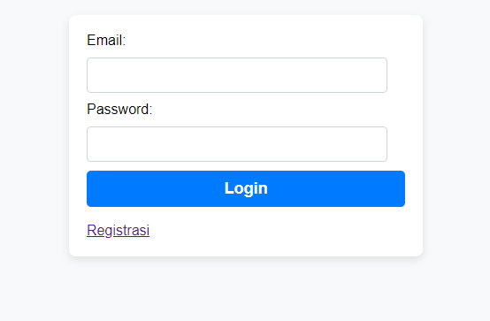
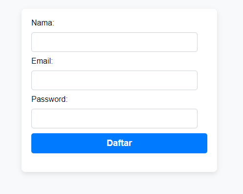
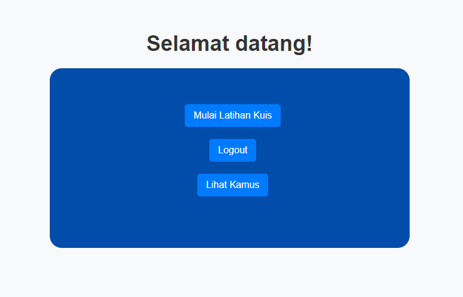
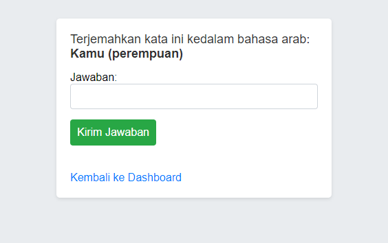

# Aplikasi Pembelajaran Bahasa

Aplikasi ini dirancang untuk membantu pengguna dalam mempelajari bahasa dengan cara yang interaktif dan menyenangkan. Pengguna dapat melakukan login, mendaftar, mengikuti kuis, dan mengakses kamus kata.

## Fitur

- **Login**: Pengguna dapat masuk ke aplikasi dengan email dan password.
- **Registrasi**: Pengguna baru dapat mendaftar untuk membuat akun.
- **Dashboard**: Halaman utama yang memberikan akses ke fitur lain dalam aplikasi.
- **Kuis**: Pengguna dapat menguji pemahaman mereka dengan mengikuti kuis interaktif.
- **Kamus**: Pengguna dapat mencari arti kata dalam berbagai bahasa.

## Struktur Aplikasi

### Halaman

1. **Login**
   - URL: `http://localhost/app/Minggu-2/Selasa/bahasa/login.php`
   - Deskripsi: Halaman untuk login pengguna.
   

2. **Registrasi**
   - URL: `http://localhost/app/Minggu-2/Selasa/bahasa/register.php`
   - Deskripsi: Halaman untuk pengguna baru mendaftar.
      

3. **Dashboard**
   - URL: `http://localhost/app/Minggu-2/Selasa/bahasa/dashboard.php`
   - Deskripsi: Halaman utama aplikasi setelah login, berisi ringkasan fitur yang tersedia.
     

4. **Kuis**
   - URL: `http://localhost/app/Minggu-2/Selasa/bahasa/quiz.php`
   - Deskripsi: Halaman untuk pengguna mengikuti kuis tentang kosakata dan tata bahasa.
     

5. **Kamus**
   - URL: `http://localhost/app/Minggu-2/Selasa/bahasa/kamus.php`
   - Deskripsi: Halaman yang menampilkan daftar kosakata dan arti dalam berbagai bahasa.
     

## Teknologi yang Digunakan

- **PHP**: Bahasa pemrograman untuk backend.
- **MySQL**: Database untuk menyimpan data pengguna, kosakata, dan hasil kuis.
- **HTML/CSS**: Untuk membuat antarmuka pengguna.